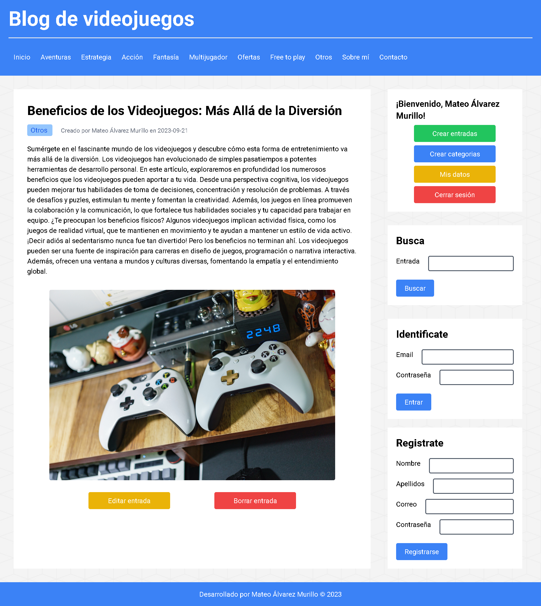

# Video games blog

El propósito de este proyecto es recrear un blog de videojuegos donde los usuarios puedan registrarse, iniciar sesión, crear, editar y eliminar publicaciones, entre otras funciones.

Se empleó Tailwind CSS para la maquetación y PHP en gran medida para la lógica del backend.

## Funcionalidades

_Registro e Inicio de Sesión Seguros:_ Se implementó encriptación de contraseñas y medidas de seguridad contra ataques de SQL injection para garantizar la integridad de los datos de los usuarios.

_Creación, Edición y Eliminación de Publicaciones:_ Tendrás el control total sobre tus publicaciones, con la capacidad de crear nuevas, editar las existentes o eliminarlas según tus preferencias.

_Gestión de Categorías:_ Organiza tus publicaciones en categorías personalizadas para una mejor navegación y acceso.

_Perfil de Usuario Personalizado:_ Edita tu perfil según tus preferencias, incluyendo cambios en tu nombre de usuario, apellidos y dirección de correo electrónico.

_Motor de Búsqueda:_ Explora nuestro blog de manera eficiente utilizando nuestro buscador, que te permite buscar publicaciones por título o contenido.

## Vistazo rápido



## Requisitos previos

Antes de comenzar, asegúrate de tener instalado `npm` en tu sistema. Si no lo tienes instalado, puedes descargarlo e instalarlo desde [el sitio web oficial de Node.js](https://nodejs.org/).

Además, ten en cuenta que para ejecutar este proyecto de manera completa, necesitarás tener PHP y un servidor MySQL configurado en tu entorno de desarrollo. Asegúrate de que tu servidor PHP esté funcionando correctamente y que tengas acceso a una base de datos MySQL para que todas las funcionalidades del proyecto se ejecuten sin problemas.

**Recomendación:** Para facilitar la configuración de un servidor PHP y MySQL en tu entorno de desarrollo, recomiendo utilizar XAMPP, una solución todo en uno que incluye Apache (para PHP) y MySQL en un solo paquete. Puedes descargar XAMPP desde [el sitio web oficial de XAMPP](https://www.apachefriends.org/index.html). Esto simplificará la configuración y te permitirá comenzar rápidamente con tu proyecto.

**Recomendación:** Para facilitar aún más el desarrollo y la prueba de tu proyecto PHP en Visual Studio Code, te recomendamos instalar la extensión "PHP Server" disponible en el Marketplace de VS Code. Esta extensión proporciona una forma conveniente de ejecutar aplicaciones PHP directamente desde el editor. Puedes encontrar la extensión [aquí](https://marketplace.visualstudio.com/items?itemName=brapifra.phpserver).

## Instalación

1. Clona este repositorio en tu máquina local o descargar la carpeta comprimida del proyecto:

   ```bash
   git clone https://github.com/drifterDev/video-games-blog.git
   ```

2. Descargar las dependencias necesarias del proyecto:

   ```bash
   npm install
   ```

3. Ejecutar el comando para compilar los archivos de Tailwind CSS:

   ```bash
   npm run build
   ```

4. Configurar la conexión a la base de datos en el archivo `app/includes/Connection.php`:

   ```php
   define("SERVER", "localhost");
   define("DATABASE", "nombre_de_la_base_de_datos");
   define("USERNAME", "tu_usuario");
   define("PASSWORD", "tu_contraseña");
   ```

## Sin xampp

1. Ubicarse en la raíz del proyecto y ejecutar el comando para iniciar el servidor PHP:

   ```bash
   php -S localhost:8000 app/index.php
   ```

2. Si el navegador no permite el acceso a los estilos CSS, utilizar la extensión "PHP Server" de Visual Studio Code para iniciar el servidor PHP" y acceder al proyecto.

## Con xampp

1. Abre el panel de control de XAMPP y asegúrate de que los servicios de Apache y MySQL estén "Running" (ejecutándose). Si no lo están, haz clic en los botones "Start" junto a esos servicios para iniciarlos.

2. Coloca este proyecto en el directorio `htdocs` de XAMPP. Por defecto, el directorio `htdocs` se encuentra en la carpeta de instalación de XAMPP.

3. Abre tu navegador web y accede al proyecto utilizando la URL `http://localhost/nombre_del_proyecto`. Reemplaza "nombre_de_tu_proyecto" con la carpeta o ruta relativa donde esté el proyecto dentro del directorio `htdocs`. Por ejemplo, si el proyecto está en `C:\xampp\htdocs\proyecto`, debes acceder a `http://localhost/proyecto`.

## Contribuciones

Aprecio cualquier sugerencia para mejorar el contenido de este proyecto. Si deseas contribuir, por favor crea un "issue" en el repositorio o contáctame directamente. Valoraré tus aportes para mejorar este repositorio.

## Licencia proyecto

Los códigos incluidos en este proyecto están bajo la Licencia MIT. Para obtener más información, consulta el archivo "LICENSE" en la raíz del repositorio.

## Licencia de terceros

Las imágenes utilizadas en este proyecto han sido obtenidas de Pexels.com, un sitio web que ofrece fotos de alta calidad de dominio público sin restricciones de licencia. Aunque no es necesario dar atribución en muchos casos, quiero reconocer y agradecer a la comunidad de Pexels por proporcionar recursos visuales gratuitos.

Para obtener más información sobre la licencia de las imágenes específicas utilizadas en este proyecto, consulta las políticas de licencia en el sitio web de Pexels: [Pexels License](https://www.pexels.com/license/).
