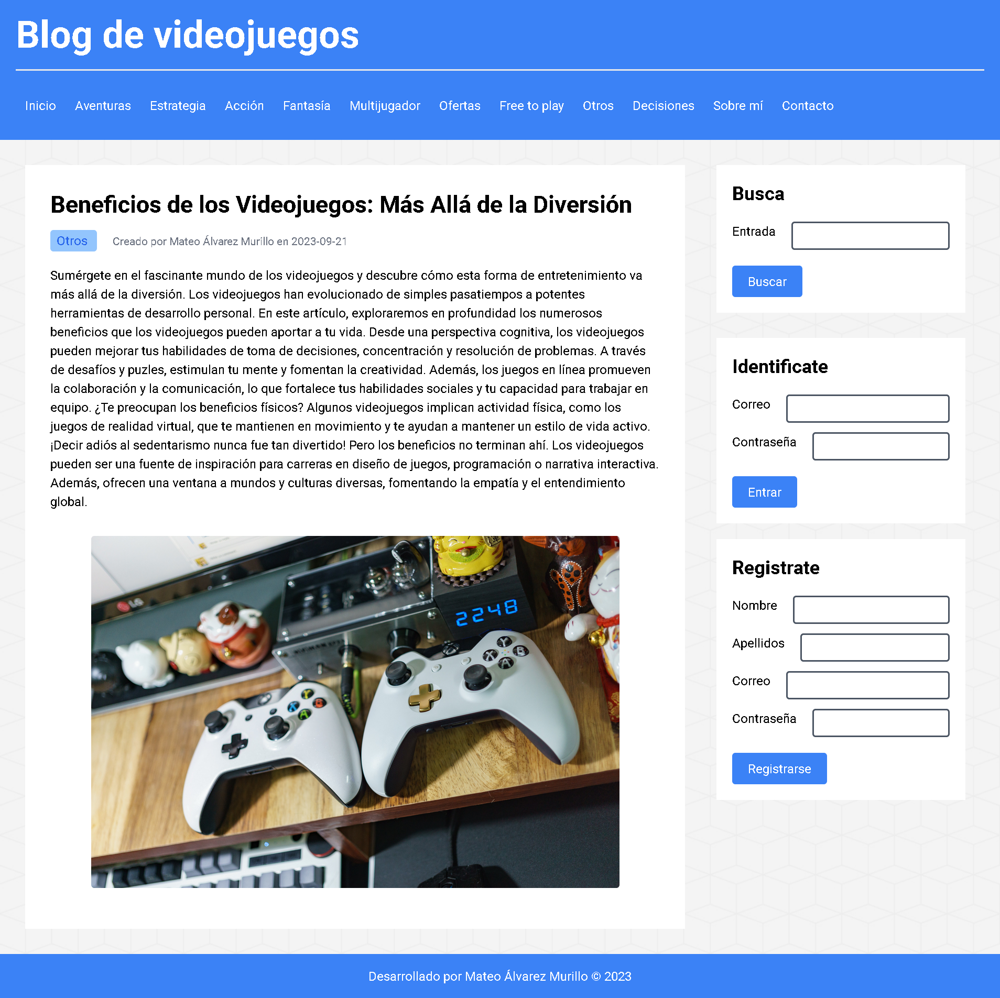
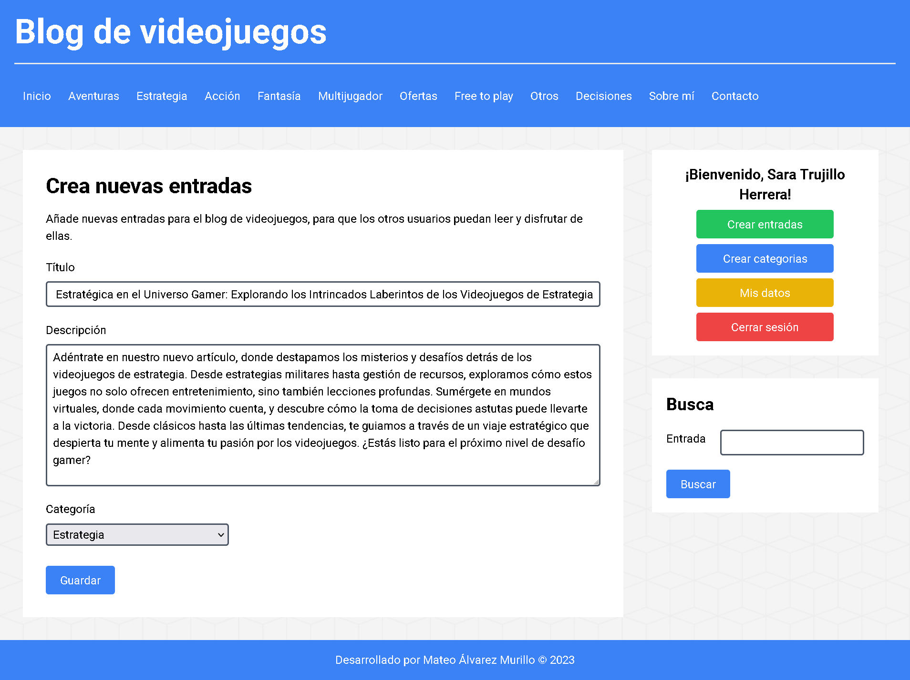
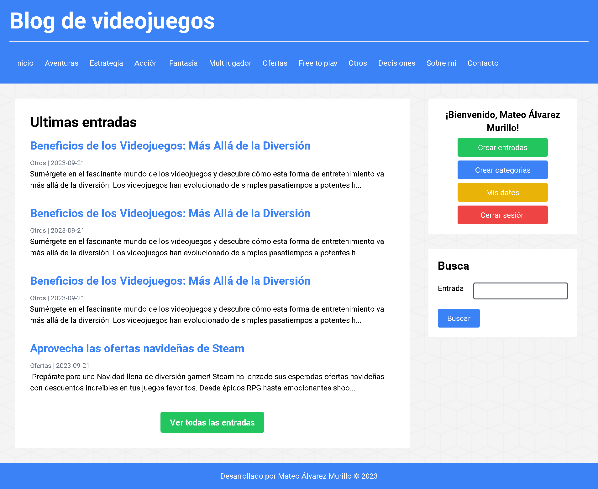

# Blog de videojuegos

El propósito de este proyecto es recrear un blog de videojuegos donde los usuarios puedan registrarse, iniciar sesión, crear, editar y eliminar publicaciones, entre otras funciones.

## Funcionalidades

_Registro e Inicio de Sesión Seguros:_ Se implementó encriptación de contraseñas y medidas de seguridad contra ataques de SQL injection para garantizar la integridad de los datos de los usuarios.

_Creación, Edición y Eliminación de Publicaciones:_ Tendrás el control total sobre tus publicaciones, con la capacidad de crear nuevas, editar las existentes o eliminarlas según tus preferencias.

_Gestión de Categorías:_ Organiza tus publicaciones en categorías personalizadas para una mejor navegación y acceso.

_Perfil de Usuario Personalizado:_ Edita tu perfil según tus preferencias, incluyendo cambios en tu nombre de usuario, apellidos y dirección de correo electrónico.

_Motor de Búsqueda:_ Explora nuestro blog de manera eficiente utilizando nuestro buscador, que te permite buscar publicaciones por título o contenido.

## Vista previa



## Comenzando

1. Clona este repositorio en tu máquina local o descargar la carpeta comprimida del proyecto:

   ```bash
   git clone https://github.com/drifterDev/video-games-blog.git
   ```

### Prerrequisitos

Antes de comenzar, asegúrate de tener instalado `npm` en tu sistema. Si no lo tienes instalado, puedes descargarlo e instalarlo desde [el sitio web oficial de Node.js](https://nodejs.org/).

Además, ten en cuenta que para ejecutar este proyecto de manera completa, necesitarás tener PHP y un servidor MySQL configurado en tu entorno de desarrollo. Asegúrate de que tu servidor PHP esté funcionando correctamente y que tengas acceso a una base de datos MySQL para que todas las funcionalidades del proyecto se ejecuten sin problemas.

**Recomendación:** Para facilitar la configuración de un servidor PHP y MySQL en tu entorno de desarrollo, recomiendo utilizar XAMPP, una solución todo en uno que incluye Apache (para PHP) y MySQL en un solo paquete. Puedes descargar XAMPP desde [el sitio web oficial de XAMPP](https://www.apachefriends.org/index.html). Esto simplificará la configuración y te permitirá comenzar rápidamente con tu proyecto.

### Instalación

1. Descargar las dependencias necesarias del proyecto:

   ```bash
   npm install
   ```

2. Ejecutar el comando para compilar los archivos de Tailwind CSS:

   ```bash
   npm run build
   ```

3. Configurar la conexión a la base de datos en el archivo `app/includes/Connection.php`:

   ```php
   define("SERVER", "localhost");
   define("DATABASE", "nombre_de_la_base_de_datos");
   define("USERNAME", "tu_usuario");
   define("PASSWORD", "tu_contraseña");
   ```

4. Ejecutar el script SQL `app/assets/database/database.sql` en tu servidor MySQL para crear la base de datos y las tablas necesarias para el proyecto (Recuerda cambiar el valor de nombre_de_la_base_de_datos).

## Iniciar el proyecto

1. Para iniciar el proyecto dirigete a la carpeta `app` y ejecuta el siguiente comando:

   ```bash
   php -S localhost:8000
   ```

2. Abre tu navegador web y dirígete a la siguiente dirección:

   ```bash
   http://localhost:8000
   ```

3. Tambien puedes iniciar el proyecto utilizando XAMPP. Para ello, copia la carpeta `app` en la carpeta `htdocs` de tu instalación de XAMPP. Luego, inicia los servicios de Apache y MySQL en XAMPP y abre tu navegador web en la siguiente dirección:

   ```bash
   http://localhost/app
   ```

4. Otra posible opción es utilizar la extensión de VSCode [PHP server](https://marketplace.visualstudio.com/items?itemName=brapifra.phpserver) para iniciar el proyecto. Para ello, abre la carpeta `app` en VSCode y presiona `F1` para abrir el menú de comandos. Luego, escribe `PHP Server: Serve Project` y presiona `Enter` para iniciar el proyecto.

## Construido con

- [TailwindCSS](https://tailwindcss.com/) - El framework CSS utilizado
- [MySQL](https://www.mysql.com/) - Gestor de base de datos
- [PHP](https://www.php.net/) - Lenguaje de programación para el backend

## Más vistas previas





## Contribuyendo

Aprecio cualquier sugerencia para mejorar el contenido de este proyecto. Si deseas contribuir, por favor crea un "issue" en el repositorio o contáctame directamente. Valoraré tus aportes para mejorar este repositorio.

## Licencia

Los códigos incluidos en este proyecto están bajo la Licencia MIT. Para obtener más información, consulta el archivo [LICENSE](LICENSE) en la raíz del repositorio.

## Licencia de terceros

Las imágenes utilizadas en este proyecto han sido obtenidas de Pexels.com, un sitio web que ofrece fotos de alta calidad de dominio público sin restricciones de licencia. Aunque no es necesario dar atribución en muchos casos, quiero reconocer y agradecer a la comunidad de Pexels por proporcionar recursos visuales gratuitos.

Para obtener más información sobre la licencia de las imágenes específicas utilizadas en este proyecto, consulta las políticas de licencia en el sitio web de Pexels: [Pexels License](https://www.pexels.com/license/).
